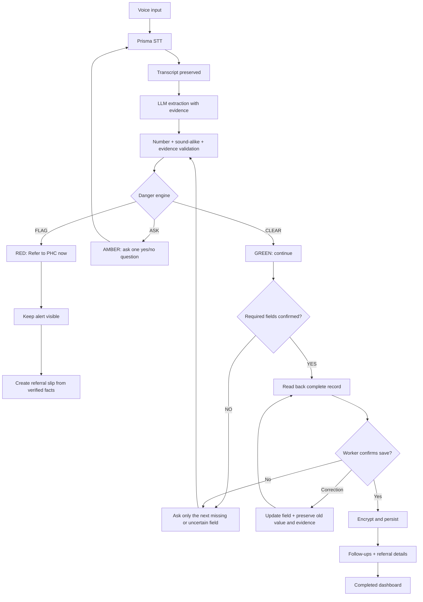

# Core decision flow

```mermaid
flowchart TD
  A[Voice input] --> B[Prisma STT]
  B --> C[Transcript preserved]
  C --> D[LLM extraction with evidence]
  D --> E[Number + sound-alike + evidence validation]
  E --> F{Danger engine}
  F -->|FLAG| G[RED: Refer to PHC now]
  G --> G1[Keep alert visible]
  G1 --> G2[Create referral slip from verified facts]
  F -->|ASK| H[AMBER: ask one yes/no question]
  H --> B
  F -->|CLEAR| I[GREEN: continue]
  I --> J{Required fields confirmed?}
  J -->|NO| K[Ask only the next missing or uncertain field]
  K --> E
  J -->|YES| L[Read back complete record]
  L --> M{Worker confirms save?}
  M -->|Correction| N[Update field + preserve old value and evidence]
  N --> L
  M -->|No| K
  M -->|Yes| O[Encrypt and persist]
  O --> P[Follow-ups + referral details]
  P --> Q[Completed dashboard]
```

The LLM extracts facts only. Clinical danger decisions remain deterministic and auditable.
