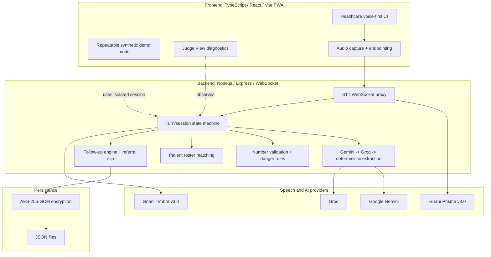

# Technology stack

```mermaid
flowchart TB
  subgraph Frontend[Frontend: TypeScript / React / Vite PWA]
    UI[Healthcare voice-first UI]
    Demo[Repeatable synthetic demo mode]
    Judge[Judge View diagnostics]
    Audio[Audio capture + endpointing]
  end
  subgraph Backend[Backend: Node.js / Express / WebSocket]
    Proxy[STT WebSocket proxy]
    Turn[Turn/session state machine]
    Extract[Gemini -> Groq -> deterministic extraction]
    Safety[Number validation + danger rules]
    Roster[Patient roster matching]
    Followups[Follow-up engine + referral slip]
  end
  subgraph Providers[Speech and AI providers]
    Prisma[Gnani Prisma v3.0]
    Timbre[Gnani Timbre v3.0]
    Gemini[Google Gemini]
    Groq[Groq]
  end
  subgraph Storage[Persistence]
    JSON[JSON files]
    AES[AES-256-GCM encryption]
  end
  UI --> Audio --> Proxy --> Prisma
  Proxy --> Turn --> Extract
  Extract --> Gemini
  Extract --> Groq
  Turn --> Safety
  Turn --> Roster
  Turn --> Followups
  Turn --> Timbre
  Followups --> AES --> JSON
  Judge -. observes .-> Turn
  Demo -. uses isolated session .-> Turn
```

No FastAPI, SQLite, Fernet, or other unverified components are implied by this diagram. The repository uses TypeScript/Node and encrypted JSON persistence.
